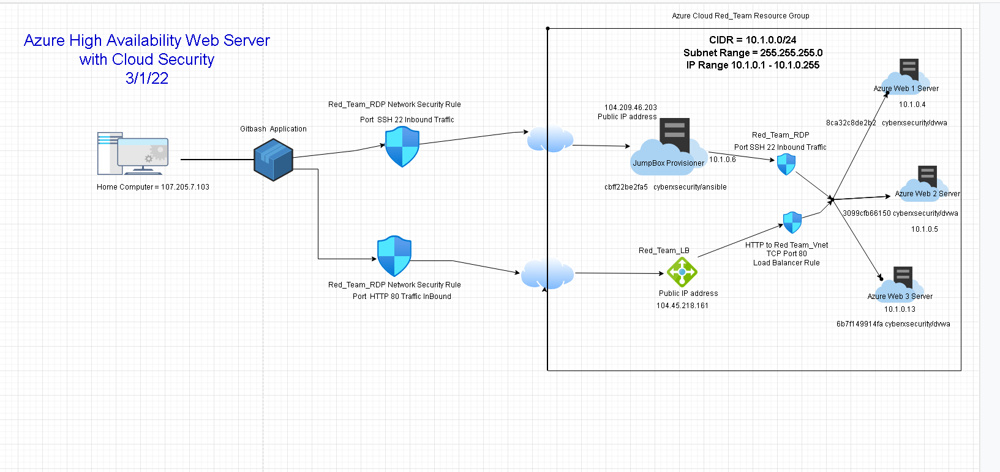

## Automated ELK Stack Deployment

The files in this repository were used to configure the network depicted below.

These files have been tested and used to generate a live ELK deployment on Azure. They can be used to either recreate the entire deployment pictured above. Alternatively, select portions of the playbook file may be used to install only certain pieces of it, such as Filebeat.

  - _install-elk.yml,Ansible Host File, Ansible.cfg_

This document contains the following details:
- Description of the Topology
- Access Policies
- ELK Configuration
  - Beats in Use
  - Machines Being Monitored
- How to Use the Ansible Build

### Description of the Topology

The main purpose of this network is to expose a load-balanced and monitored instance of DVWA, the D*mn Vulnerable Web Application.

Load balancing ensures that the application will be highly Availability, in addition to restricting access to the network.
- _Load Balancers protect the network from Distribute denial-of-Server attacks (DDoS) by shifting the attack traffic from corporate server back to cloud provider. Jumpbox seperates or allow the WebVms to be in a seperate security zone which protects the WebVMs from public access and potential security breach._

Integrating an ELK server allows users to easily monitor the vulnerable VMs for changes to the Server logs and system metrics.
- _What does Filebeat watch for? Filebeats monitor the log files or locations you specify
- _What does Metricbeat record? It records metric data from target Servers such as OS metrics, memory, other beats, and metrics you specify

The configuration details of each machine may be found below.
_Note: Use the [Markdown Table Generator](http://www.tablesgenerator.com/markdown_tables) to add/remove values from the table_.

| Name     | Function | IP Address | Operating System |
|----------|----------|------------|------------------|
| Jump Box | Ansible  | 10.1.0.6   | Linux            |
| Elk      | Elkstack | 10.3.0.5   | Linux            |
| Web-1    |  Docker  | 10.1.0.4   | Linux            |
| Web-2    |  Docker  | 10.1.0.5   | Linux            |
| Web-3    |  Docker  | 10.1.0.13  | Linux            |

### Access Policies

The machines on the internal network are not exposed to the public Internet. 

Only the gatewy machine can accept connections from the Internet. Access to this machine is only allowed from the following IP addresses:
- _107.205.7.103_

Machines within the network can only be accessed by ansible by using SSH connection.
- _Which machine did you allow to access your ELK VM? 10.1.0.6_

A summary of the access policies in place can be found in the table below.

| Name     | Publicly Accessible | Allowed IP Addresses |
|----------|---------------------|----------------------|
| Jump Box | Yes                 | 107.205.7.103        |
|  Elk     | Yes                 | 107.205.7.103        |
|  Web-1   | No                  | 10.3.0.5  10.1.0.6   |
|  Web-2   | No                  | 10.3.0.5  10.1.0.6   |
|  Web-3   | No                  | 10.3.0.5  10.1.0.6   |
|  LB      | Yes                 | 107.205.7.103        |

### Elk Configuration

Ansible was used to automate configuration of the ELK machine. No configuration was performed manually, which is advantageous because...
- _What is the main advantage of automating configuration with Ansible? Using Ansible save a lot of time that is saved instead of manually installing the software. Ansible has a big costing in that it is virtual install rather than buying expense hardware. Ansible allows for easy configuration and setup and maintenance_

The playbook implements the following tasks:
- _In 3-5 bullets, explain the steps of the ELK installation play. E.g., install Docker; download image; etc._
- Create a new Vnet
- Create a Peer Network Connection
- Edit Ansible cfg on Jumpbox
- Create ELK playbook
- Download Docker container 
- Install and configured the ELK container

The following screenshot displays the result of running `docker ps` after successfully configuring the ELK instance.

![Update the path with the name of your screenshot of docker ps output]Images/docker_ps_output.png

### Target Machines & Beats
This ELK server is configured to monitor the following machines:
- _List the IP addresses of the machines you are monitoring
 _ 10.1.0.4, 10.1.0.5,10.1.0.13  

We have installed the following Beats on these machines:
- _Specify which Beats you successfully installed_
I successfully installed Filebeat and Metricbeat

These Beats allow us to collect the following information from each machine:
- In 1-2 sentences, explain what kind of data each beat collects, and provide 1 example of what you expect to see. E.g., `Winlogbeat` collects Windows logs, which we use to track user logon events, etc._
Filebeats monitor the log files, or locations you specify. One log i monitor was the IIS logs. Expect to see Response codes overtime or Error logs overtime. 
-Metricbeat records metric data from target Servers such as OS metrics, memory, other beats, and metrics you specify. I montiored the CPU and Memory Usage

### Using the Playbook
In order to use the playbook, you will need to have an Ansible control node already configured. Assuming you have such a control node provisioned: 

SSH into the control node and follow the steps below:
- Copy the _YAML____ file to _Ansible VM____.
- Update the _YAML Playbook____ file to include App install, Virtual Memory increase, Download and launch docker elk container
- Run the playbook, and navigate to home and runsudo docker ps to check that the installation worked as expected.

_TODO: Answer the following questions to fill in the blanks:_
- _Which file is the playbook? install-elk.yml
   Where do you copy it? ansible of jump box to home/etc/ansible
- _Which file do you update to make Ansible run the playbook on a specific machine? hosts
How do I specify which machine to install the ELK server on versus which to install Filebeat on? comment the host file with [elk}, then include the server IP address and version of python to run. 
- _Which URL do you navigate to in order to check that the ELK server is running? http://20.119.192.185:5601/app/kibana

_As a **Bonus**, provide the specific commands the user will need to run to download the playbook, update the files, etc._
ansible-playbook install-elk.yml

